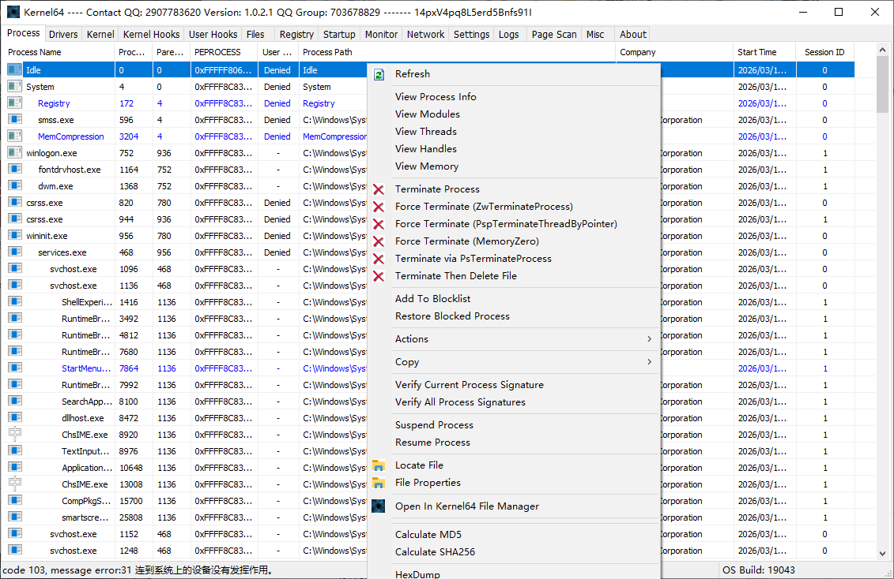
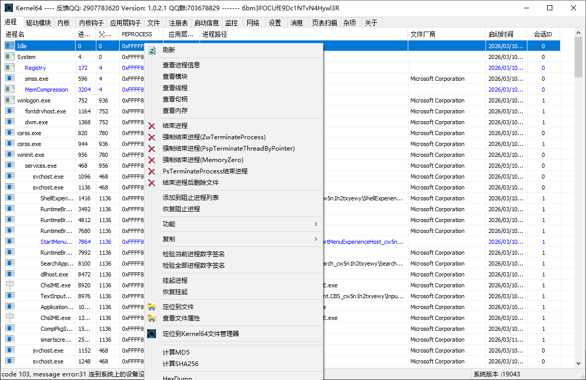

# Kernel64Ark

感谢 Saileaxh 提供的符号在线解析网站解析

Microsoft符号镜像站：
http://msdl.saileaxh.com/download/symbols/

HexScan特征码扫描器：
https://hex.saileaxh.com/scan/

PDB文件在线解析服务接口：
https://bbs.kanxue.com/thread-290244.htm

> 仅供合法学习与交流使用。  
> For legal learning, research, and communication only.

## 简介 | Overview

`Kernel64Ark` 是一个面向 Windows 内核研究、系统枚举、符号解析、监控与调试辅助场景的免费学习交流工具。  
`Kernel64Ark` is a free tool intended for Windows kernel research, system enumeration, symbol parsing, monitoring, and debugging practice.

本文档根据现有发布说明整理为中英双语版本，便于阅读与归档。  
This document reorganizes the existing release notes into a bilingual Chinese-English format for easier reading and archival.

 ## 界面截图 | Screenshots

  

    
    
  

## 免责声明 | Disclaimer

### 中文

1. 本软件（`Kernel64Ark`）为免费学习交流工具，作者仅提供软件本身，不提供任何形式的技术支持、质量保证或使用承诺，软件的稳定性、兼容性等均不做担保。
2. 因 ARK 工具的特殊性，使用本软件可能存在蓝屏、程序崩溃、系统异常等风险，进而导致数据丢失、设备损坏、业务中断等直接或间接损失。用户使用前必须备份所有重要数据，使用行为即视为自愿承担全部风险，作者对任何损失不承担任何赔偿责任。
3. 软件的著作权归作者所有，未经作者书面授权：
   - 禁止用于商业用途（包括但不限于有偿提供服务、捆绑销售、广告植入等）；
   - 禁止进行篡改、反向工程、破解、脱壳、分发破解版、二次封装等侵犯知识产权的行为。
4. 禁止将本软件用于任何非法或恶意用途，包括但不限于：
   - 作为病毒、木马、恶意程序的组件；
   - 破解网吧收费系统、软件授权保护、网络安全防护等；
   - 侵犯他人隐私、窃取数据、破坏计算机信息系统等违反《网络安全法》《刑法》等法律法规的行为。  
   若违反本条，用户需自行承担全部法律责任，与作者无关。
5. 本软件仅限合法的学习交流场景使用，若用户使用本软件导致第三方侵权，应在收到侵权通知后 24 小时内停止使用并删除软件，作者不承担连带侵权责任。
6. 用户通过 QQ（`2907783620`）或 QQ 群（`703678829`）反馈的 BUG、建议，作者可自主决定是否修复或采纳，不构成必须履行的义务，不承诺修复时效。
7. 作者有权根据实际情况修改本免责声明，修改后的版本将通过上述 QQ / QQ 群或软件更新公告发布，用户继续使用软件即视为接受修改后的条款。
8. 本免责声明自用户首次使用软件之日起生效，未尽事宜均适用中华人民共和国相关法律法规。

### English

1. `Kernel64Ark` is a free tool provided for learning and technical exchange. The author only provides the software itself and does not provide technical support, quality guarantees, or usage commitments. No warranty is made regarding stability, compatibility, or fitness for any purpose.
2. Due to the nature of ARK-style tools, using this software may involve risks such as blue screens, crashes, or other system abnormalities, which may further result in data loss, device damage, business interruption, or other direct or indirect losses. Users must back up all important data before use. Any use of the software is deemed voluntary acceptance of all related risks, and the author bears no liability for any loss.
3. Copyright of the software belongs to the author. Without prior written authorization:
   - Commercial use is prohibited, including but not limited to paid services, bundled sales, or advertising insertion;
   - Tampering, reverse engineering, cracking, unpacking, redistributing cracked versions, or repackaging that infringes intellectual property rights is prohibited.
4. The software must not be used for any illegal or malicious purpose, including but not limited to:
   - Serving as a component of viruses, trojans, or other malicious software;
   - Bypassing cybercafé billing systems, software licensing protections, or security defenses;
   - Violating laws and regulations such as the PRC Cybersecurity Law or Criminal Law by infringing privacy, stealing data, or damaging computer information systems.  
   If this clause is violated, the user shall bear all legal responsibility, and the author is not related to such conduct.
5. This software is limited to lawful learning and communication scenarios. If a user's use results in third-party infringement claims, the user must stop using and delete the software within 24 hours after receiving notice. The author assumes no contributory or joint liability.
6. For bugs or suggestions submitted via QQ (`2907783620`) or the QQ group (`703678829`), the author may independently decide whether to fix or adopt them. This does not constitute an obligation, and no repair timeline is promised.
7. The author reserves the right to revise this disclaimer as needed. Revised versions may be announced through the QQ contact, QQ group, or update notices. Continued use of the software is deemed acceptance of the revised terms.
8. This disclaimer takes effect from the user's first use of the software. Matters not covered herein shall be governed by applicable laws and regulations of the People's Republic of China.

## 反馈方式 | Feedback

- QQ：`2907783620`
- QQ 群：`703678829`
- 欢迎反馈 BUG 和优化建议，感谢支持。  
  Bug reports and optimization suggestions are welcome. Thank you for your support.

## 更新日志 | Changelog

### 1.0.1.1

- 修复 SSDT，并增加 inline hook 检查与恢复。  
  Fixed SSDT issues and added inline-hook checking and restoration.
- 修复 ShadowSSDT，并增加 inline hook 检查与恢复。  
  Fixed ShadowSSDT issues and added inline-hook checking and restoration.
- 修复 IDT 地址错误。  
  Fixed incorrect IDT addresses.
- 新增内核钩子。  
  Added kernel hook functionality.
- 新增文件系统与 minifilter 相关功能，移除时不再卡顿。  
  Added file-system and minifilter functionality; removal no longer stalls.
- 新增 FSD 派发函数。  
  Added FSD dispatch routine support.
- 新增 Keybd 派发函数。  
  Added keyboard dispatch routine support.
- 新增 I8024 派发函数。  
  Added I8024 dispatch routine support.
- 新增 Mouse 派发函数。  
  Added mouse dispatch routine support.
- 新增 `HalDispatchTable` 枚举。  
  Added `HalDispatchTable` enumeration.
- 新增 `Wdf01000` 派发函数。  
  Added `Wdf01000` dispatch routine support.
- 新增即插即用（Plug and Play）回调。  
  Added Plug and Play callback support.
- 新增反汇编窗口。  
  Added a disassembly window.
- SSDT 与 ShadowSSDT 增加重载后的地址显示。  
  Added display of reloaded addresses in SSDT and ShadowSSDT views.
- 新增进程树显示效果。  
  Added a process-tree style view.
- 新增启动项表。  
  Added a startup-items table.
- 新增服务表。  
  Added a services table.
- 新增计划任务表。  
  Added a scheduled-tasks table.
- 进程、驱动、文件菜单新增数字签名校验。  
  Added digital-signature verification to process, driver, and file menus.
- 增加简单的应用层注入。  
  Added simple user-mode injection.

### 1.0.1.2

- 增强进程枚举操作。  
  Improved process enumeration.
- 增强驱动枚举操作。  
  Improved driver enumeration.
- 增强反汇编符号支持。  
  Improved disassembly symbol handling.
- 使用共享内存与事件（Event）通信。  
  Switched communication to shared memory plus events.
- 新增全局监控。  
  Added global monitoring.

#### 全局监控事件 | Global Monitoring Events

| 中文 | English |
| --- | --- |
| 进程创建 | Process create |
| 进程退出 | Process exit |
| 进程挂起 | Process suspend |
| 线程创建 | Thread create |
| 线程退出 | Thread exit |
| 驱动加载 | Driver load |
| DLL 加载 | DLL load |
| 模块卸载 | Module unload |
| 文件创建 | File create |
| 目录查询 | Directory query |
| 文件读取 | File read |
| 文件写入 | File write |
| 注册表创建 | Registry key create |
| 注册表删除 | Registry key delete |
| 网络连接 | Network connect |
| 未知事件 | Unknown event |

- 下载多个符号文件，获取原始函数地址以检测挂钩。  
  Downloaded multiple symbol files to retrieve original function addresses for hook detection.
- 获取多个派发函数的原始函数地址以恢复挂钩。  
  Retrieved original addresses for multiple dispatch routines to restore hooks.
- 新增 `HalPrivateDispatchTable`、`HalAcpiDispatchTable`、`HalSubComponents` 枚举。  
  Added enumeration for `HalPrivateDispatchTable`, `HalAcpiDispatchTable`, and `HalSubComponents`.
- 修复软件下载符号失败问题；即使下载失败，也可在设置界面点击并在关闭软件后通过注册表值替换。  
  Fixed symbol-download failures; even if downloading fails, the value can still be changed through settings and applied through the registry after the program closes.
- 修复 SSDT 与 ShadowSSDT 显示函数名错误的问题，改为通过符号文件获取函数名。  
  Fixed incorrect SSDT and ShadowSSDT function names by resolving names from symbol files.
- 新增进程 `KernelCallbackTable` 枚举。  
  Added process `KernelCallbackTable` enumeration.
- 新增进程 VAD 枚举（后续移除）。  
  Added process VAD enumeration (later removed).
- 当时的后续计划：新增进程窗口热键、定时器、消息钩子与 object。  
  Planned next items at the time: process-window hotkeys, timers, message hooks, and object support.
- 当时的考虑项：下载进度条、内核钩子菜单、扫描符号表。  
  Considered at the time: a download progress bar, kernel-hook menu items, and symbol-table scanning.

### 1.0.1.3

> 记录日期 / Recorded date: `2025-12-07`

- 内核回调增加禁用函数。  
  Added a disable function for kernel callbacks.
- 修复线程状态显示。  
  Fixed thread-state display.
- 添加 `HalIommuDispatchTable`。  
  Added `HalIommuDispatchTable`.
- 修复驱动加载失败错误码显示。  
  Fixed display of driver-load failure error codes.
- 添加保护进程。  
  Added protected-process functionality.
- 修复符号偶尔能加载、偶尔加载不了的问题。  
  Fixed unstable symbol loading.
- 修复一些 BUG，并减少内存分配。  
  Fixed several bugs and reduced memory allocations.
- 反汇编器增加编辑内核功能。  
  Added kernel editing in the disassembler.
- 添加 `WFP Filter`。  
  Added `WFP Filter`.
- 计划任务增加菜单。  
  Added menu actions for scheduled tasks.
- 添加 `WFP Object`。  
  Added `WFP Object`.
- 为过滤驱动增加 `DPC` / `IoTimer` 功能菜单。  
  Added `DPC` / `IoTimer` menu features for filter drivers.

### 1.0.1.4

> 记录日期 / Recorded date: `2026-01-21`

- 添加两个结束进程按钮。  
  Added two terminate-process buttons.
- 修复反汇编导致蓝屏的问题。  
  Fixed a BSOD issue in the disassembly view.
- 添加文件句柄菜单。  
  Added a file-handle menu.
- 设置界面添加符号修改器。  
  Added a symbol modifier in settings.
- 修复 SSDT 名字显示错误。  
  Fixed incorrect SSDT name display.
- 进程-模块界面添加菜单。  
  Added menu actions in the process-module view.
- 添加阻止运行列表。  
  Added a block-run list.
- 添加应用层 APC DLL 注入。  
  Added user-mode APC DLL injection.
- 添加进程挂起计数检测。  
  Added process suspend-count detection.
- 添加 `speedhack`。  
  Added `speedhack`.
- 支持注册表值修改。  
  Added registry-value modification.
- 计划任务支持禁用。  
  Added disable support for scheduled tasks.
- 添加应用层驱动加载器。  
  Added a user-mode driver loader.

### 1.0.1.5

> 记录日期 / Recorded date: `2026-02-02`

- 设置界面增加符号下载地址调整功能，可在下载失败时切换地址。  
  Added symbol-download source switching in settings for cases where downloads fail.
- 减少符号下载数量（此前为 20 个）。  
  Reduced the number of symbol downloads (previously 20).
- 结束进程支持多选。  
  Added multi-select process termination.
- 设置界面增加符号路径选择，适用于已下载符号但软件仍要求重下的场景。  
  Added symbol-path selection in settings for cases where symbols already exist but the software still asks to redownload them.
- 修复界面缝隙过大的问题，`1920x1080` 下显示更完整。  
  Fixed excessive UI gaps; layout now fits `1920x1080` properly.
- 修复反汇编蓝屏。  
  Fixed another disassembly-related BSOD issue.
- 添加窗口保护 / 取消保护相关选项，用于反截屏。  
  Added window-protection / unprotection options for anti-capture behavior.

#### 窗口保护值 | Window Display Affinity Values

| 值 | 宏 | 含义 | English meaning | 用途 | English usage |
| --- | --- | --- | --- | --- | --- |
| `0x00000000` | `WDA_NONE` | 无限制 | No restriction | 默认值，窗口内容可被正常捕获 | Default; content can be captured normally |
| `0x00000001` | `WDA_MONITOR` | 显示器亲和 | Monitor affinity | 窗口仅显示在主显示器上，阻止 GDI / DirectX 捕获 | Restricts display to the monitor and blocks GDI / DirectX capture |
| `0x00000011` | `WDA_EXCLUDEFROMCAPTURE` | 排除捕获 | Exclude from capture | 完全阻止截图、录屏、缩略图、放大镜等 | Blocks screenshots, screen recording, thumbnails, magnifier, and similar capture paths |

- 调整布局，继续修复此前缝隙过大的问题。  
  Adjusted layout to further address previous spacing issues.
- 加强隐藏进程能力，过 `ydark` / `opernark`。  
  Strengthened hidden-process behavior, including bypass cases related to `ydark` / `opernark`.
- 新增应用层钩子界面，并将进程菜单中的进程钩子迁移到该界面。  
  Added a user-mode hook view and moved process-hook actions there from the process context menu.
- 应用层代码加入 `Zydis` 库，用于扫描进程钩子。  
  Added the `Zydis` library to user-mode code for process-hook scanning.
- 新增加扫描进程钩子功能。  
  Added process-hook scanning.
- 增加对 `ntoskrnl.exe` 钩子的扫描。  
  Added scanning for `ntoskrnl.exe` hooks.
- 移除进程热键。  
  Removed process hotkeys.
- 移除消息钩子。  
  Removed message hooks.
- 移除进程定时器。  
  Removed process timers.
- 检测 `InfinityHook` 时在 SSDT 标签页弹窗提示。  
  Added SSDT-tab pop-up notification for `InfinityHook` detection.
- 添加简单版隐藏驱动。  
  Added a simple hidden-driver feature.

### 1.0.1.6

- 添加进程伪装。  
  Added process masquerading.
- 添加内存加载驱动。  
  Added memory-loaded driver support.
- 添加常见的内核注入方式，包括远程线程注入。  
  Added common kernel injection methods, including remote-thread injection.
- 进程内存增加分配与释放功能。  
  Added memory allocation and free operations for process memory.
- 模块界面增加隐藏模块。  
  Added hide-module functionality in the module view.
- 增加各种 IRP 菜单。  
  Added various IRP menu actions.
- 增加各种 HAL 菜单。  
  Added various HAL menu actions.
- 通过 `PspCidTable` 枚举隐藏进程。  
  Added hidden-process enumeration through `PspCidTable`.
- 增加隐藏驱动扫描。  
  Added hidden-driver scanning.
- 通过 `NtQueryVirtualMemory` 遍历隐藏进程。  
  Added hidden-process traversal through `NtQueryVirtualMemory`.

### 1.0.1.7

- 修复若干 BUG。  
  Fixed several bugs.
- 扫描内存加载驱动，并在驱动右键菜单中添加相关设置。  
  Added memory-loaded driver scanning and related options in the driver context menu.
- 进程界面增加应用层内存加载 DLL。  
  Added user-mode memory-loaded DLL support in the process view.
- 修复 Windows 7 下 SSDT 结果全部错误的问题。  
  Fixed completely incorrect SSDT results on Windows 7.
- 添加 `DumpDriver`。  
  Added `DumpDriver`.
- 添加页表扫描，目前仅支持虚拟地址转物理地址；内核态下使用，且开启监控时无法扫描。  
  Added page-table scanning; currently only virtual-to-physical translation is available, it works in kernel mode, and scanning cannot run while monitoring is enabled.
- SSDT 与 ShadowSSDT 界面仅显示被 Hook 的函数信息。  
  Changed SSDT and ShadowSSDT views to display only hooked functions.
- 隐藏进程仅断链一个；断链线程很快会蓝屏。  
  Hidden-process handling unlinks only one chain; unlinking threads causes BSOD very quickly.

### 1.0.1.8

- 添加进程权限显示。  
  Added process-privilege display.
- 添加驱动线程查看。  
  Added driver-thread viewing.
- 添加驱动 IRP 查看。  
  Added driver IRP viewing.
- 进程和文件增加 `MD5`、`SHA256` 计算。  
  Added `MD5` and `SHA256` calculation for processes and files.
- 增加全局监控中进程、线程、模块的开关控制。  
  Added toggles for process, thread, and module monitoring in global monitoring.
- 页表查找增加 `HexDump` 与文件界面 / 文件树 `HexDump`。  
  Added `HexDump` support to page-table lookup and the file/file-tree views.
- 设置界面增加 `DSE` 开关，并新增 `ci.dll` 符号下载。  
  Added a `DSE` toggle in settings and support for downloading `ci.dll` symbols.
- 检测内核隔离 `HVCI` 是否开启。  
  Added detection for kernel isolation / `HVCI`.
- 添加线程栈回溯（`Stack Walk`），应用层实现。  
  Added thread stack walking implemented in user mode.
- 修复 `Windows 11 24H2` 后结构变化导致定时器、热键、消息钩子无法枚举的问题。  
  Fixed enumeration of timers, hotkeys, and message hooks after structure changes in `Windows 11 24H2`.
- 网络界面增加菜单。  
  Added menu actions in the network view.
- 驱动界面增加复制文件菜单。  
  Added a copy-file menu in the driver view.
- 修复快速切换导致程序崩溃的问题。  
  Fixed crashes caused by rapid view switching.
- `HexDump` 支持修改。  
  Added editing support to `HexDump`.
- 回调界面增加恢复功能，以配合之前版本的 Patch。  
  Added restore support in the callback view to work with earlier patch behavior.
- 修复枚举进程热键时 `vk` 显示错误的问题。  
  Fixed incorrect `vk` display during process hotkey enumeration.

### 1.0.1.9

- 添加致谢名单。  
  Added an acknowledgements list.
- 添加内核弹窗。  
  Added kernel popup support.
- 添加 `InfinityHook V`（暂未提供接口，后续继续）；测试文件打不开。  
  Added `InfinityHook V` (no public interface yet; work to continue later); the test file could not be opened.
- 添加文件过滤动态补丁。  
  Added a dynamic patch for file filtering.
- `HexDump` 加快速度，做到秒显示。  
  Greatly improved `HexDump` speed for near-instant display.
- 优化进程枚举。  
  Optimized process enumeration.
- 扫描隐藏驱动特征码，不再扫描 `R/W/X` 权限。  
  Added hidden-driver signature scanning and stopped scanning `R/W/X` permissions.
- 系统回调补丁区分显示。  
  Improved differentiated display of system callback patch areas.
- `HexDump` 增加菜单。  
  Added menu actions to `HexDump`.
- 添加 `Ctrl+C` 热键复制一行。  
  Added `Ctrl+C` to copy a single line.
- `Dump` 内核模块，当前为简单导出，未修复导入表和导出表。  
  Added simple kernel-module dump support without repairing import or export tables.
- 修复读取大内存时 `0x50 PAGE_FAULT_IN_NONPAGED_AREA` 蓝屏问题。  
  Fixed `0x50 PAGE_FAULT_IN_NONPAGED_AREA` BSODs when reading large memory regions.
- 增加拷贝进程模块。  
  Added process-module copying.
- `HexDump` 增加应用层内存 `Dump`。  
  Added user-mode memory dump support to `HexDump`.
- 添加 `Ctrl+F` 查找。  
  Added `Ctrl+F` search.

### 1.0.2.0

- 修复 `HexDump` 进程内存容易蓝屏的问题。  
  Fixed BSOD-prone process-memory handling in `HexDump`.
- 修复 Patch 容易蓝屏的问题（待测试）。  
  Reduced BSOD risk during patching (still pending further testing).
- 修复枚举进程热键容易失效的问题。  
  Fixed unstable process-hotkey enumeration.
- 修复枚举进程定时器容易失效的问题。  
  Fixed unstable process-timer enumeration.
- 发布 `Release` 版本（加了 `VMP` 后更稳定）。  
  Released a `Release` build, reported as more stable after adding `VMP`.
- 优化界面显示。  
  Optimized UI presentation.
- `HexDump` 增加几种编码格式。  
  Added several encoding formats to `HexDump`.
- 移除内核钩子扫描和 `ntoskrnl` 钩子扫描，这些功能性价比较低且容易蓝屏。  
  Removed kernel-hook scanning and `ntoskrnl` hook scanning because they were costly, low value, and prone to BSOD.
- 新增加进程页表。  
  Added process page-table support.
- 使用多线程下载 `PDB` 符号文件。  
  Switched `PDB` downloads to multithreading.
- 进程 VAD 改用 `VirtualQuery` 查询。  
  Switched process VAD queries to `VirtualQuery`.
- 加强 `IDT Hook` 检测。  
  Strengthened `IDT` hook detection.

### 1.0.2.1

- 内核 APC 注入。  
  Added kernel APC injection.
- 修复 `HexDump` 的进程内存与内核内存处理。  
  Fixed `HexDump` handling for both process memory and kernel memory.
- 修复之前的 `wfpcallout`。  
  Fixed the previous `WFP callout` implementation.
- 修复扫描隐藏驱动时数量未清零的小问题。  
  Fixed a small issue where the hidden-driver count was not reset.
- 设置界面增加中英文切换。  
  Added Chinese / English language switching in settings.
- 优化监控界面。  
  Optimized the monitoring view.
- 文件界面增加物理磁盘解析。  
  Added physical-disk parsing in the file view.
- 新增几个回调。  
  Added several callbacks.
- 网络界面增加 `hosts` 文件编辑。  
  Added `hosts` file editing in the network view.
- 设置界面增加特征码搜索。  
  Added signature-pattern search in settings.
- 设置界面增加 inline hook。  
  Added inline-hook functionality in settings.
- 反汇编界面增加软 / 硬件断点下断，暂未接管。  
  Added software / hardware breakpoint placement in the disassembly view, though it is not fully managed yet.
- 添加杂项界面，包含符号解析与 `MyDbgView`。  
  Added a miscellaneous view containing symbol parsing and `MyDbgView`.
- 远程通过看雪文章中的网站查询 `PDB`，只需联网查询一次。  
  Added remote `PDB` lookup through the website referenced in the Kanxue article, requiring only one online lookup.
- 上一条改动的缺点是反汇编时不能显示符号解析，这次改动较大。  
  A drawback of the previous change is that symbol resolution can no longer be shown in the disassembly view; this was a large internal change.
- 适配网站查询 `PDB`。  
  Adapted the software to website-based `PDB` lookup.
- 派发函数恢复功能重新正常工作，因为之前取不到原始函数地址。  
  Dispatch-routine restoration works again because original function addresses can now be retrieved.
- 恢复内核钩子扫描，但目前只扫描 `EAT` 表。  
  Restored kernel-hook scanning, currently limited to the `EAT` table.

## 参考资料 | References

- <https://learn.microsoft.com/zh-cn/windows-hardware/drivers/debugger/bug-check-0x109---critical-structure-corruption>
- <https://www.vergiliusproject.com/kernels/x64/windows-7/sp1/_EPROCESS>
- <https://learn.microsoft.com/en-us/openspecs/windows_protocols/ms-erref/596a1078-e883-4972-9bbc-49e60bebca55>
- <https://learn.microsoft.com/en-us/windows/security/hardware-security/enable-virtualization-based-protection-of-code-integrity?tabs=security>
- <https://learn.microsoft.com/en-us/windows/win32/api/winternl/nf-winternl-ntquerysysteminformation>
- <https://www.unknowncheats.me/>
- <https://hexrays.su/>
- <https://r0keb.github.io/posts/PatchGuard-Internals/>
- <https://github.com/zodiacon/ProcMonXv2?tab=readme-ov-file>
